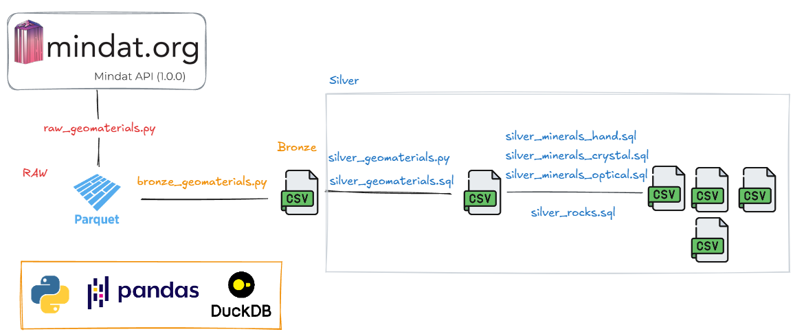

# mindapp

---

Testing the Mindat API and running some data scripts. The project aims to:

* run an API **extraction** using a python script and saving a bronze layer
* create a **transformed** silver layer tables with curated information about rocks (`silver_rocks.sql`)
and about minerals hand-specimen features (`silver_materials_hand.sql`), crystallography (`silver_minerals_crystal.sql`)
and optical features (`silver_minerals_optical.sql`)

